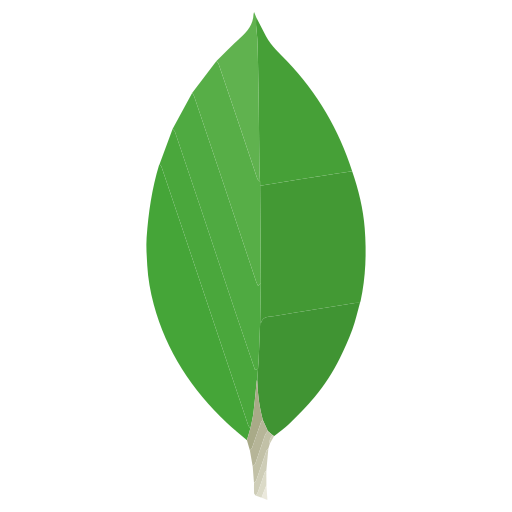

 
  
<h1>About Me</h2>

<h2 align="center">
  
</h1>
<h3 align="center">Linux administrator and DevOps engineer </h3>

  

- 🔭 I’m currently working on [NexusCLI](https://github.com/IliyaAG/NexusCLI)

- 🌱 I’m currently learning **Devops and its tools**

- 👯 I’m looking to collaborate on [zabbix-installer](https://github.com/IliyaAG/zabbix-installer)

- 🤝 I’m looking for help with [zabbix-installer](https://github.com/IliyaAG/zabbix-installer)

- 📝 I regularly write articles on [https://doc-dooni.xyz]()

- 💬 Ask me about **Linux and unix like operating systems**

- 📫 How to reach me **iliyaagh76@gmail.com**

<h3 align="left">Connect with me:</h3>

 
  
<h1>🛠️ My Favorite Tools</h1>

  <h3>🐧 Operating System</h3>
  

      
  

  <h3>💻 Programming Languages & Tools</h3>
  

      
      
      
      
      
  

  <h3>☸️ Containerization & Orchestration</h3>
  

      
      
      
  

  <h3>🔄 CI/CD & DevOps Tools</h3>
  

      
      
      
      
      
      
      
  

  <h3>📊 Monitoring & Observability</h3>
  

      
      
      
      
      
      
      
      
      
      
  

  <h3>🌐 Web Servers, Load Balancers & Services</h3>
  

      
      
      
      
      
  

  <h3>💾 Storage & Object Storage</h3>
  

      
      
  

  <h3>🗄 Databases</h3>
      
      
      
      
      
      
      
  

  

  <h3>🧪 Performance & Security Testing</h3>
  

      
      
      
  

  <h3>☁️ Virtualization & Infrastructure</h3>
  

      
      
      
  

 
  
<h1>⚡Github Stats⚡</h1>

 

  

    
    
  

           
  

    
  

   

  

<h2 align="center">💻 Repositories 💻</h2>
 

  

      

  

  

  

  

      

<!--
  
 -->
